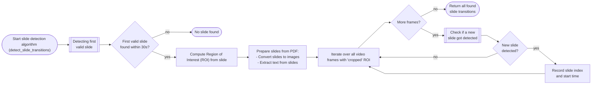
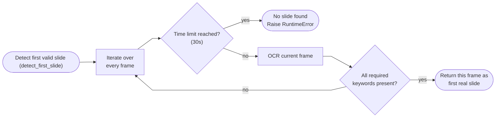
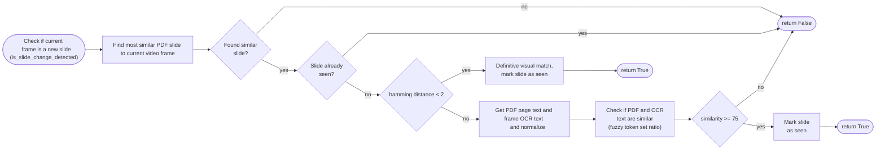

- [lecture-slide-sync](#lecture-slide-sync)
  - [Video Demo](#video-demo)
  - [What it does](#what-it-does)
  - [Installation & Quickstart](#installation--quickstart)
  - [How to use it](#how-to-use-it)
    - [Parameters (UI & API)](#parameters-ui--api)
    - [Web UI](#web-ui)
    - [HTTP API (curl)](#http-api-curl)
    - [Important processing notes (Read Before Running)](#important-processing-notes-read-before-running)
  - [Known limitations / could be added](#known-limitations--could-be-added)
  - [How it works](#how-it-works)
    - [Algorithm Overview (detect_slide_transitions)](#algorithm-overview-detect_slide_transitions)
    - [First-Slide Scan (detect_first_slide)](#first-slide-scan-detect_first_slide)
    - [New-Slide Decision (is_slide_change_detected)](#new-slide-decision-is_slide_change_detected)
  - [Tech stack](#tech-stack)
  - [Repository map](#repository-map)
  - [Other practical use cases for the generated subtitle (.srt) file](#other-practical-use-cases-for-the-generated-subtitle-srt-file)

# lecture-slide-sync
Syncs lecture videos with their PDF slides to produce slide-grouped subtitles and an optional chaptered video, enabling a chatbot to cite the exact slide and timestamp. 

(_Bachelor’s thesis project - FH Aachen)._


## Video Demo 

<p align="center">
  <video
    src="https://github.com/user-attachments/assets/ee9a1d85-dc5e-4cdd-a1f7-6ea77f971fe8"
    controls
    muted
    playsinline
    poster="docs/demo_poster.png"
    style="max-width:900px;width:100%;border-radius:10px;">
  </video>
</p>

<br>

## What it does

This project **detects when each slide appears** from a lecture **video** and the matching **PDF**, 
then creates a **subtitle file (.srt)** where everything spoken **while that slide is on screen**
is merged into **one block per slide**. 

You can also export a **chaptered video**, bookmarks are added at the start of each slide, making it easy to jump around between slides when watching the lecture.

### Normal SRT vs. merged-by-slide SRT

In a **typical SRT**, the transcript is split into many short segments that don’t align with slide boundaries.
This project **detects slide changes** and then **merges all segments that occurred during a single slide** into
one block for that slide.

**Typical SRT generated by an ASR tool like [Whisper](https://github.com/openai/whisper) (many tiny segments belonging to _Slide 10_)**
```srt
21
00:12:05,100 --> 00:12:06,900
The midterm is in March,

22
00:12:07,000 --> 00:12:09,800
and it will cover chapters one to five.

23
00:12:10,000 --> 00:12:12,000
The format is multiple choice,

24
00:12:12,100 --> 00:12:14,900
plus two short explanations.
````

**Next slide begins, more tiny segments (now *Slide 11*)**

```srt
25
00:12:15,000 --> 00:12:20,000
The project is done in pairs.

26
00:12:20,100 --> 00:12:25,000
Submit via the portal by April 30.
```

**Result of this project:**
*All short segments for each slide are merged into a single block that covers that slide’s time window.*

```srt
10
00:12:05,000 --> 00:12:14,900
The midterm is in March, and it will cover chapters one to five.
The format is multiple choice, plus two short explanations.

11
00:12:15,000 --> 00:12:25,000
The project is done in pairs. Submit via the portal by April 30.
```

### Use case for chatbot

Because each slide now has **one subtitle block with an exact time range**, a chatbot can:

* retrieve the **right slide** for a question,
* quote the relevant text, and
* link to the **exact timestamp** in the lecture.

**Example**

**Student asks:**

> “When is the midterm and what’s the format?”

**Chatbot:**

> **Answer:** The midterm is in **March**; the format is **multiple choice** plus two short explanations.
> **Source:** *Slide 10 — Exam dates* at **00:12:05** (Lecture 01).
> **Jump:** `…/lecture01.mp4#t=00:12:30` *(example deep link to an internal video server)*

<br>

## Installation & Quickstart

<details>
<summary><strong>Docker (recommended)</strong></summary>

### Clone & build

```bash
git clone https://github.com/Fingii/lecture-slide-sync
cd lecture-slide-sync
docker build -t lecture-slide-sync .
```

### Environment variables (Docker)

| Env var           | Allowed values                                                                                                       | Default | Meaning (Docker)                                                                                             |
| ----------------- | -------------------------------------------------------------------------------------------------------------------- | :-----: | ------------------------------------------------------------------------------------------------------------ |
| `WHISPER_MOUNTED` | `true`, `false`                                                                                                      |  `true` | `true` = **mount** a local folder of models into the container; `false` = **auto-download** inside container |
| `WHISPER_MODEL`   | `tiny`, `tiny.en`, `base`, `base.en`, `small`, `small.en`, `medium`, `medium.en`, `large-v1`, `large-v2`, `large-v3` |  `base` | Which model to use.                                                                                          |

<details>
<summary><strong>Option A — Pre-download locally, then mount (preferred for re-use)</strong></summary>

<br>

**Step 1 — Download any model(s) you want to use** from the <a href="https://huggingface.co/collections/Systran/faster-whisper-6867ecec0e757ee14896e2d3">SYSTRAN Faster-Whisper collection</a>
into a folder **named exactly like the model id** (e.g., `base`, `small`, `medium.en`).

> The **host folder can live anywhere** on your machine. You’ll mount its **parent directory** into the container.

**Example (base model)** — replace the placeholder path with your actual absolute path:

* Linux/macOS:

  ```bash
  git clone https://huggingface.co/Systran/faster-whisper-base /ABSOLUTE/PATH/faster-whisper-models/base
  ```
* Windows (PowerShell):

  ```powershell
  git clone https://huggingface.co/Systran/faster-whisper-base C:\ABSOLUTE\PATH\faster-whisper-models\base
  ```

**Example folder layout (multiple models in one folder)**

```
/ABSOLUTE/PATH/faster-whisper-models/
├─ base/                  # folder name MUST equal the model id
│  ├─ config.json
│  ├─ model.bin 
│  ├─ tokenizer.json
│  ├─ tokenizer_config.json
│  ├─ vocabulary.json
│  ├─ special_tokens_map.json
│  ├─ README.md           # (optional, from the repo)
│  └─ LICENSE             # (optional)
│
├─ medium.en/
│  ├─ config.json
│  ├─ model.bin
│  ├─ tokenizer.json
│  ├─ tokenizer_config.json
│  ├─ vocabulary.json
│  ├─ special_tokens_map.json
│  ├─ README.md
│  └─ LICENSE
```

**Step 2 — Run with a read-only mount** — replace the placeholder path with your actual absolute path:

* Linux/macOS:

  ```bash
  docker run --rm -p 8000:8000 \
    -e WHISPER_MOUNTED=true \
    -e WHISPER_MODEL=base \
    -v "/ABSOLUTE/PATH/faster-whisper-models":/lecture-slide-sync/faster-whisper-models:ro \
    lecture-slide-sync
  ```
* Windows (PowerShell):

  ```powershell
  docker run --rm -p 8000:8000 `
    -e WHISPER_MOUNTED=true `
    -e WHISPER_MODEL=base `
    --mount type=bind,source="C:\ABSOLUTE\PATH\faster-whisper-models",target=/lecture-slide-sync/faster-whisper-models,readonly `
    lecture-slide-sync
  ```

> **Use another model:** replace `-e WHISPER_MODEL=base` with your desired size, e.g. `-e WHISPER_MODEL=small`.

**Open the app:** [http://localhost:8000/](http://localhost:8000/)

</details>

<details>
<summary><strong>Option B — Auto-download inside the container (simple)</strong></summary>
<br>

Use this if you **don’t want to download and mount models manually**.
This increases the container’s **writable layer**, removing the container means re-downloading the models when creating a new fresh container.

```bash
docker run --rm -p 8000:8000 \
  -e WHISPER_MOUNTED=false \
  -e WHISPER_MODEL=base \
  lecture-slide-sync
```

> **Use another model:** replace `-e WHISPER_MODEL=base` with your desired size, e.g. `-e WHISPER_MODEL=small`.

**Open the app:** [http://localhost:8000/](http://localhost:8000/)

</details>

---

</details>

<details>
<summary><strong>Host (local) — Linux / Windows</strong></summary>
<br>

For host, the **easiest** method is **auto-download**: set `WHISPER_MOUNTED=false`, pick a `WHISPER_MODEL`,
and just start the server. The app will create and populate `./faster-whisper-models/<size>` under your repo
automatically—no manual steps needed.

### Prerequisites

* Python **3.10+**
* **Tesseract OCR**, **FFmpeg**
* Linux: `libgl1`, `libglib2.0-0`

### Environment variables (Host)

| Env var           | Allowed values                                                                                                       | Default | Meaning (Host)                                                                                                                        |
| ----------------- | -------------------------------------------------------------------------------------------------------------------- | :-----: | ------------------------------------------------------------------------------------------------------------------------------------- |
| `WHISPER_MOUNTED` | `true`, `false`                                                                                                      |  `true` | `false` (**recommended**) = auto-download into `./faster-whisper-models/<size>`; `true` = use that local folder if you pre-downloaded |
| `WHISPER_MODEL`   | `tiny`, `tiny.en`, `base`, `base.en`, `small`, `small.en`, `medium`, `medium.en`, `large-v1`, `large-v2`, `large-v3` |  `base` | Which model to use.                                                                                                                   |

### Clone

```bash
git clone https://github.com/Fingii/lecture-slide-sync
cd lecture-slide-sync
```

### Create venv & install deps

* Linux/macOS:

  ```bash
  python -m venv .venv
  source .venv/bin/activate
  pip install -U pip -r requirements.txt
  ```
* Windows (PowerShell):

  ```powershell
  python -m venv .venv
  .\.venv\Scripts\Activate.ps1
  pip install -U pip -r requirements.txt
  ```

#### Provide models — pick ONE

<details>
<summary><strong>Option A — Auto-download on first run (recommended on host)</strong></summary>

* Linux/macOS:

  ```bash
  export WHISPER_MOUNTED=false
  ```
* Windows (PowerShell):

  ```powershell
  $env:WHISPER_MOUNTED = "false"
  ```

This automatically creates/populates `./faster-whisper-models/<size>` under your repo.

</details>

<details>
<summary><strong>Option B — Pre-download into the repo (manual)</strong></summary>

* Linux/macOS:

  ```bash
  mkdir -p ./faster-whisper-models
  git clone https://huggingface.co/Systran/faster-whisper-base ./faster-whisper-models/base
  ```
* Windows (PowerShell):

  ```powershell
  mkdir .\faster-whisper-models
  git clone https://huggingface.co/Systran/faster-whisper-base .\faster-whisper-models\base
  ```

**Folder layout (repo root):**

```
lecture-slide-sync/
└─ faster-whisper-models/
   ├─ base/                  # folder name MUST equal the model id
   │  ├─ config.json
   │  ├─ model.bin
   │  ├─ tokenizer.json
   │  ├─ tokenizer_config.json
   │  ├─ vocabulary.json
   │  ├─ special_tokens_map.json
   │  ├─ README.md           # (optional, from the repo)
   │  └─ LICENSE             # (optional)
   ├─ medium.en/
   │  ├─ config.json
   │  ├─ model.bin
   │  ├─ tokenizer.json
   │  ├─ tokenizer_config.json
   │  ├─ vocabulary.json
   │  ├─ special_tokens_map.json
   │  ├─ README.md
   └─ └─ LICENSE

```

> Put the faster-whisper-models directory in the root of your repository, and name it exactly
> faster-whisper-models. Each subfolder name must match the model id (e.g., base, small, medium.en).

</details>

### Change model size (optional)

Set the model (default **base**) **before** starting the server, e.g. use small model:

* **Linux/macOS**

```bash
export WHISPER_MODEL=small
```

* **Windows (PowerShell)**

```powershell
$env:WHISPER_MODEL = "small"
```

### Start the server

```bash
hypercorn app.main:app --bind 0.0.0.0:8000
```

**Open the app:** [http://localhost:8000/](http://localhost:8000/)

</details>

<br>

## How to use it

Use either the **Web UI** or **HTTP API**. Both accept the same parameters (below).

### Parameters (UI & API)

| Name                | Type   | Default                                  | What it does                                                                                                     |
| ------------------- | ------ | ---------------------------------------- | ---------------------------------------------------------------------------------------------------------------- |
| `keywords`          | string | FH AACHEN UNIVERSITY OF APPLIED SCIENCES | Space-separated words that appear on the **first real slide** (e.g., footer) to skip intros/black screens etc... |
| `sampling_interval` | float  | `1.0`                                    | Seconds between analyzed frames. Lower = more precise but slower.  Higher = less precise but faster              |
| `generate_chapters` | bool   | `false`                                  | If `true`, also return an `.mp4` with slide chapters.                                                            |
| `uploaded_video`    | file   | — (required)                             | Lecture video **`.mp4`**.                                                                                        |
| `uploaded_pdf`      | file   | — (required)                             | Matching **`.pdf`** of the slides.                                                                               |
| `uploaded_zip`      | file   | —                                        | ZIP for batch mode: pairs of **`lectureX.mp4`** + **`lectureX.pdf`** with the **same name stem**.                |

### Web UI

1. Open [http://localhost:8000/](http://localhost:8000/).
2. Choose **Single** (video + PDF) or **Batch** (ZIP with pairs).
3. Configure parameters and click **Start Processing** and wait for the result file.

---

### HTTP API (curl)

### Examples:

**Single lecture** — `POST /detect`

* **Linux/macOS**

  ```bash
  curl -X POST http://localhost:8000/detect \
    -F 'keywords=NAME OF UNIVERSITY' \
    -F 'sampling_interval=1.0' \
    -F 'generate_chapters=false' \
    -F 'uploaded_video=@lecture1.mp4' \
    -F 'uploaded_pdf=@lecture1.pdf' \
    -o lecture1_merged.srt
  ```

- **Windows (PowerShell)**

  ```powershell
  curl.exe -X POST http://localhost:8000/detect `
    -F "keywords=NAME OF UNIVERSITY" `
    -F "sampling_interval=1.0" `
    -F "generate_chapters=false" `
    -F "uploaded_video=@lecture1.mp4" `
    -F "uploaded_pdf=@lecture1.pdf" `
    -o lecture1_merged.srt
  ```

**Batch** — `POST /batch-detect`

* ZIP layout:

  ```
  lectures.zip
  ├── lecture1.mp4
  ├── lecture1.pdf
  ├── lecture2.mp4
  └── lecture2.pdf
  ```
* **Linux/macOS**

  ```bash
  curl -X POST http://localhost:8000/batch-detect \
    -F 'uploaded_zip=@lectures.zip' \
    -F 'keywords=FH AACHEN UNIVERSITY OF APPLIED SCIENCES' \
    -F 'sampling_interval=1.0' \
    -F 'generate_chapters=true' \
    -o batch_results.zip
  ```
* **Windows (PowerShell)**

  ```powershell
  curl.exe -X POST http://localhost:8000/batch-detect `
    -F "uploaded_zip=@lectures.zip" `
    -F "keywords=FH AACHEN UNIVERSITY OF APPLIED SCIENCES" `
    -F "sampling_interval=1.0" `
    -F "generate_chapters=true" `
    -o batch_results.zip
  ```

---

### Important processing notes (Read Before Running)

<details>
<summary><strong>PDF Requirements</strong></summary>

* Only slides that exist in the uploaded **PDF** can be detected. If your video contains additional content
  (e.g., handwritten slides, whiteboards, live demos) that isn’t in the PDF, it will be ignored and grouped
  under the previous detected slide — the **timestamp continues** until the next valid slide change.
* **Must contain extractable text** — scanned/image-only PDFs won’t work.

</details>

<details>
<summary><strong>Video Requirements</strong></summary>

* The slide **MUST** be fully visible as a single clear rectangle. It’s fine if other elements (like the
  professor or chat window) are:

  * Fully **outside** the slide area
  * **Inside** the slide but not blocking important content
  * **Not overlapping** the slide border (e.g., half in / half out)
* This is important because the tool tries to detect the slide as **one solid rectangular block**.

</details>

<details>
<summary><strong>Detection Behavior</strong></summary>

* **Skips intros automatically** – the tool waits until the first real slide from your uploaded PDF is visible
  (ignoring black screens, Zoom/Webex interfaces, etc.).
* Because detection is based on matching video frames against the full PDF slides, slides with animations or
  bullet-by-bullet reveals are usually only recognized **once the slide is completely visible**, i.e., when all
  bullet points or elements are shown.
* Best results occur with **static slides** that match the PDF exactly and appear clearly at slide start.

</details>

<br>

## Known limitations / could be added

* **Animated slides are detected late**

  * For slides with animations or bullet-by-bullet reveals, detection typically triggers only when the slide reaches its final, PDF-matching state on screen.
  * **Add:** backtracking to the first frame where the slide actually started.

* **OFF-PDF segments (live demos, handwriting, IDE/browser) are merged into the previous slide**

  * Matching is PDF-based, so content not in the PDF (code editor, whiteboard, browser, document camera etc...) ends up attached to the last detected slide.
  * **Add:** detect when we’re **not on a PDF slide** and **separate these intervals** (e.g., own SRT block/“chapter”), rather than merging into slides.

* **Parallelism**

  * A single lecture: slide detection → then Whisper transcription (ASR).
  * A ZIP: each pair is processed in sequence.
  * **Add:**

    * Run **slide detection and Whisper transcription in parallel** for the same lecture.
    * Run **multiple lectures in parallel** (one worker per pair) for batch processing.

* **Cancellation / abort (server + UI)**

  * The current “Cancel” button is client-only; backend jobs run to completion.
  * **Add:** server-side cancellation so long-running processing can be aborted from the UI.

* **Progress UX**

  * Current progress bar is **fake** (step-based; not time-accurate).
  * **Add:** real-time progress via **SSE/WebSocket**

* **Media storage & course organization**

  * Videos persist in `media/`, but there’s **no video server** and **no course scoping**. Name collisions like
    `lecture01.mp4` across courses are possible.
  * **Add:** simple video server with **deep links** (`#t=...`), storage by course (e.g., `media/<course>/<file>`),
    and a small **admin UI** to allowlist courses/modules to avoid collisions.

* **Performance hotspots**

  * Converting decoded frames to NumPy arrays before yielding `decoded_frame_ndarray: np.ndarray = decoded_frame.to_ndarray(format="bgr24")`.
  * **CPU-only Whisper** (**Add:** GPU support (CUDA) for faster-whisper)

<br>

## How it works

1. **Upload & prepare inputs**
   You upload a **video** and the matching **PDF**. PDF slides are converted to images and their text is
   extracted with [PyMuPDF](https://pymupdf.readthedocs.io/). The video is decoded (every frame) with
   [PyAV](https://github.com/PyAV-Org/PyAV).

2. **Find the first real slide / skip intros (via keywords + OCR)**
   You provide **keywords that appear on the first real slide** (e.g., a footer line). Frames are OCR’d
   with [pytesseract](https://github.com/madmaze/pytesseract) until those keywords are detected, for 30 seconds.
   This **skips intros**, black screens, and conferencing UIs (Zoom/Webex) before the lecture starts.

3. **Lock onto the slide region once**
   After step 2 confirms the **first real slide**, the app detects the rectangular slide area on that frame
   (largest clean rectangle via [OpenCV](https://opencv.org/)) and sets it as the **Region of Interest (ROI)**.
   This ROI is assumed to **stay constant for the rest of the lecture** and is reused for all frames, which
   filters out surrounding noise (chat windows, participant lists, etc.) and makes matching more robust.

4. **Match frames to PDF slides (visual first, text if needed)**
   Each PDF slide image gets a perceptual **pHash** with [imagehash](https://github.com/JohannesBuchner/imagehash).
   For each sampled frame, the ROI’s pHash is compared to all slide pHashes (Hamming distance).
   If the visual score isn’t decisive, the ROI text is OCR’d and compared to the PDF page text using [fuzzy
   matching](https://github.com/seatgeek/thefuzz). If **neither** visual nor text scores are strong, we treat the frame as
   **no change** (still on the previous slide).

5. **Record slide start times**
   For each newly detected slide, store a mapping `slide_index → start_time` (seconds). End times are derived
   later when merging SRT (next slide’s start, or the video end for the last slide).

6. **Transcribe and merge by slide**
   Audio is transcribed with [faster-whisper](https://github.com/SYSTRAN/faster-whisper).
   The many short ASR segments are **merged into one SRT block per slide interval**, yielding slide-grouped
   subtitles, as described earlier.

7. **(Optional) Add chapters to the video**
   The slide timeline is converted into chapter metadata and muxed into a copy of the video via
   [FFmpeg](https://ffmpeg.org/), creating one **chapter per slide**.

8. **Batch mode (ZIP)**
   If you upload a ZIP, files are paired by matching names (e.g., `lecture1.mp4` ↔ `lecture1.pdf`, `lecture2.mp4` ↔ `lecture2.pdf` etc...) and the same
   pipeline runs for each pair.

### Algorithm Overview (detect\_slide\_transitions)



### First-Slide Scan (detect\_first\_slide)



### New-Slide Decision (is\_slide\_change\_detected)



<br>

## Tech stack

* **Backend** — Python 3.10+, [FastAPI](https://fastapi.tiangolo.com/), served by [Hypercorn](https://pgjones.gitlab.io/hypercorn/).
* **Video decoding** — [PyAV](https://github.com/PyAV-Org/PyAV)
* **Computer vision** — [OpenCV](https://opencv.org/) (+ NumPy) for ROI detection.
* **PDF parsing** — [PyMuPDF](https://pymupdf.readthedocs.io/) (convert pages into images + extract text).
* **OCR** — [pytesseract](https://github.com/madmaze/pytesseract) + Tesseract.
* **Visual image matching** — [imagehash (pHash)](https://github.com/JohannesBuchner/imagehash).
* **Text fallback** — [thefuzz](https://github.com/seatgeek/thefuzz) (token-set ratio).
* **ASR / SRT Generation** — [faster-whisper](https://github.com/SYSTRAN/faster-whisper)
* **Chapters / muxing** — [FFmpeg](https://ffmpeg.org/).
* **Testing** - [pytest](https://docs.pytest.org/en/stable/).
* **Container** — Docker.
* **Logging** — Python logging via `logs/logging_config.json`.
* **Web UI** — Jinja2 templates, Bootstrap CSS, minimal vanilla JS.

<br>

## Repository map

* `app/main.py` — ASGI app, static/templates mount, logging bootstrap.
* `app/api/endpoints.py` — FastAPI routes; upload handling; ZIP/SRT lifecycle.
* `app/core/processing.py` — Orchestrates ASR + slide detection and merges results; returns `(merged_srt: str, slide_changes: dict[int, float])`.
* `app/core/slide_detection.py` — Orchestrates first-slide detection, ROI lock, frame→PDF matching.
* `app/core/srt_utils.py` — Faster-Whisper transcription, SRT parse/merge, time utilities, model loading.
* `app/core/video_chapter_embedder.py` — Writes FFmpeg chapter metadata into an `.mp4`.
* `app/core/file_utils.py` — Save uploads, find batch pairs, ZIP helpers.
* `app/core/hashing_utils.py` — pHash + Hamming distance helpers.
* `app/core/image_utils.py` — Image ops (preprocessing, ROI crops) used by detection.
* `app/core/ocr_keywords_detector.py` — OCR keyword matching for “first real slide”.
* `app/models/video_frame.py` — Frame container: ROI, pHash, OCR text, timestamps.
* `app/models/lecture_slides.py` — PDF→images, page text extraction, slide pHashes.
* `app/models/slide_tracker.py` — Tracks current slide, already seen slides and threshold (\_max\_hamming\_distance) for slide detection.
* `app/templates/index.html` — Minimal Web UI (Jinja2/Bootstrap).
* `app/static/css/styles.css` — UI styles (plus any JS in `app/static/`).
* `logs/logging_config.json` — Logger names, levels, rotating file handlers.

<br>

## Other practical use cases for the generated subtitle (.srt) file

* **Search & jump:** keyword search that takes you directly to the **matching slide/time**.
* **Summarization:** generate **slide-wise summaries** or an outline of the full lecture.
* **Study aids:** build per-slide **flashcards/notes** from the grouped text.
